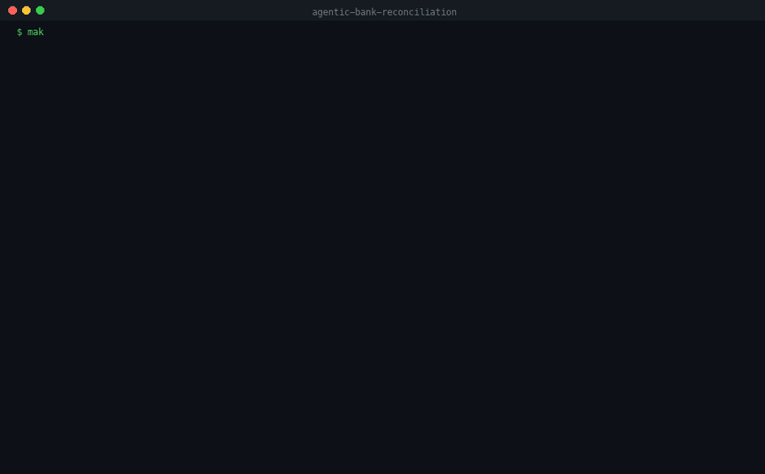
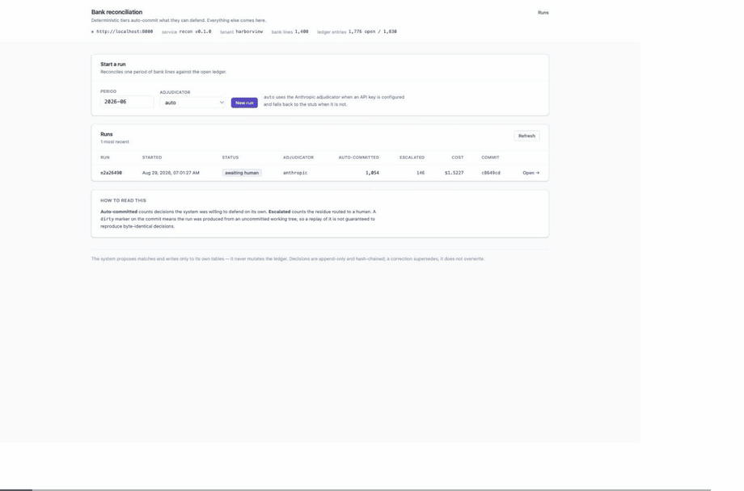
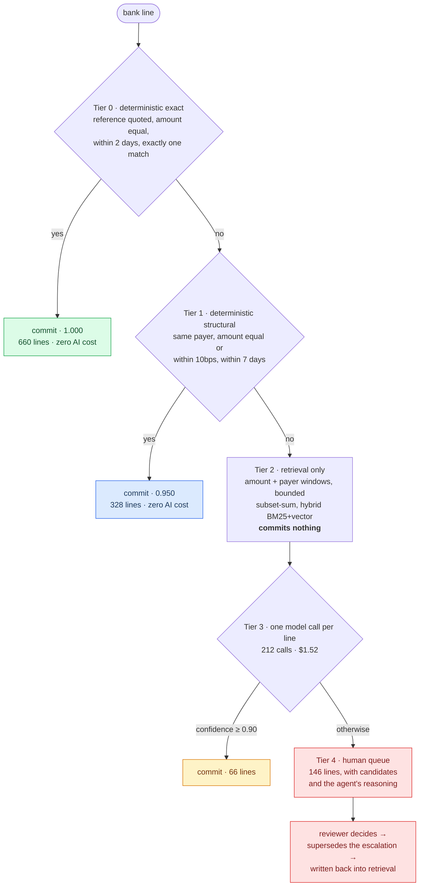

# Agentic bank reconciliation

Matches bank statement lines against ledger entries, **auto-commits only what it
can defend in writing**, and routes everything else to a human exception queue
with a reasoned recommendation. Human corrections feed back into retrieval, so
it improves per client entity.

Built on LangGraph with durable checkpointing, an append-only hash-chained audit
log, recorded-and-replayable model calls, and a 300-case eval harness.

```
1,054 of 1,200 auto-matched · 87.8%
precision 1.0000 · 0 false positives · $1.27 per 1,000 lines
replay: 1,054 of 1,054 decisions identical
```

---

## It does not touch your ledger

The system **proposes** matches. It writes only to its own tables. No journal is
posted, no invoice closed, no ledger record created, updated or deleted by this
software. Reconciliation output is a set of proposed matches with a rationale
and an audit trail; applying them to the accounting system remains a separate,
human-authorised step.

---

## See it work

One command brings the stack up, seeds a month, scores it, and reconciles it.



Then the exception queue — the model's reasoning, ranked candidates with
provenance, an approval, and the audit trail showing the escalation struck
through next to the decision that superseded it.



Both are real captures. Nothing in them is mocked up.

---

## Quickstart

```bash
cp .env.example .env          # add ANTHROPIC_API_KEY for live adjudication
make demo                     # clean slate → seed → eval → one full run
```

API on http://localhost:8000, exception queue on http://localhost:5173.

Without an API key everything still runs: Tier 3 falls back to a clearly
labelled deterministic stub, and the UI says so on every affected view. The
graph, checkpointing, interrupts, audit chain, cost ceiling and replay are all
real either way — only the judgement is not.

---

## Results

Measured on the seeded month (1,200 bank lines, 1,776 open ledger entries) with
a live `claude-sonnet-5`. Every number here is produced by `make eval`.

### Auto-match and precision

| Arm | Auto-matched | Precision | False positives |
|---|---|---|---|
| Tier 0 — exact reference | 660 / 1200 · 55.0% | 1.0000 | **0** |
| Tiers 0–1 — all deterministic rules | 988 / 1200 · 82.3% | 1.0000 | **0** |
| **Full cascade — with model adjudication** | **1054 / 1200 · 87.8%** | **1.0000** | **0** |

### Per tier

| Tier | Committed | Correct | Wrong | Precision |
|---|---|---|---|---|
| 0 — deterministic exact | 660 | 660 | 0 | 1.0000 |
| 1 — deterministic structural | 328 | 328 | 0 | 1.0000 |
| 3 — model adjudication | 66 | 66 | 0 | 1.0000 |

### Cost and latency

| | |
|---|---|
| Model calls | 212 — one line in six, not 1,200 |
| Cost | $1.52 per month · **$1.27 per 1,000 lines** |
| Prompt cache | 93.2% of input tokens served from cache |
| Latency | p50 3,419 ms · p95 4,693 ms |

### Restraint

The model answered `insufficient_evidence` on **97 of 212** — it declined to
guess on nearly half of what reached it. That is the behaviour the whole cascade
is arguing for, and it is invisible in a precision number, so it is reported
separately.

### Retrieval and the feedback loop

| | |
|---|---|
| Tier 2 recall@10 (excluding cold-start processor lines) | 0.9875 |
| Feedback loop, next month's processor lines | **0.0000 → 1.0000** after 32 corrections |
| Replay of a stored run | **1,054 of 1,054 identical** |

---

## How it works

Five tiers, each seeing only what the previous one could not resolve. The
expensive mistake is not missing a match — it is committing a wrong one — so
the system is arranged to make being unsure cheap and being wrong expensive.



**[docs/ARCHITECTURE.md](docs/ARCHITECTURE.md)** has the full picture: the graph
and its interrupt, the data model, the audit chain, how replay is made exact,
how the feedback loop is measured, and where each guarantee is actually
enforced.

---

## Design commitments

- **Rules first, model last.** Deterministic rules clear 82.3% with zero AI
  cost. The model adjudicates only genuine ambiguity.
- **False positives are the cardinal sin.** The eval's headline is the
  false-positive count, not precision, and the regression gate fails the build
  on a single one — independently of the precision threshold.
- **Every auto-match is explainable in one sentence** a bookkeeper understands.
  No bare confidence scores.
- **Exact replay.** Every model call *and* every retrieval query is recorded and
  keyed by a hash of its exact request. Replay re-executes the deterministic
  tiers for real and serves the external calls from the recording, so it is
  provably exact rather than dependent on a model behaving identically twice. A
  recording miss fails the run rather than quietly calling live.
- **Append-only audit.** Decisions and events are never updated or deleted, only
  superseded. The event log is hash-chained and the database rejects mutation.
- **Idempotent ingest.** Re-ingesting a file is a no-op, whatever it is named.
- **Money is `Decimal`, stored as integer minor units.** Never float — enforced
  by an AST scan, not by review.

---

## Commands

| Command | Does |
|---|---|
| `make demo` | Clean slate → seed → eval → one full run. The client walkthrough. |
| `make up` / `make down` / `make reset` | Bring the stack up, stop it, destroy its data |
| `make seed` | Generate the seeded dataset, ingest it, build the retrieval index |
| `make run [PERIOD=2026-06]` | Reconcile a period through the graph |
| `make resume RUN_ID=... [SIMULATE=1]` | Resume a paused run with reviewer decisions |
| `make continue RUN_ID=...` | Resume a run whose process died, from its checkpoint |
| `make eval [RUN=<id>]` | Score the golden set; with `RUN`, score that run's full cascade |
| `make eval-baseline` | Record the current result as the regression baseline |
| `make replay RUN_ID=...` | Reproduce a stored run and diff it strictly |
| `make index` | Rebuild the Weaviate index from Postgres |
| `make check` | lint + typecheck + tests |

---

## Layout

```
api/
  migrations/            plain .sql, applied in order
  src/recon/
    money.py             the only Decimal ↔ minor-unit conversion site
    hashing.py           canonical JSON: idempotency, audit chain, replay keys
    config.py            every threshold a decision depends on, frozen per run
    ingest/              parser protocol · CSV · CAMT.053 · normalise · loader
    matching/            tier0 · tier1 · tier2 candidates · subset-sum · cascade
    retrieval/           Weaviate schema, hybrid index, recording + replay
    llm/                 versioned prompt, output contract, pricing, adjudicators
    graph/               state, nodes, audit chain, checkpointed runner
    evals/               golden set, metrics, recall@10, ablation, run scoring
    api/                 read models and run orchestration
  tests/                 268 tests
web/                     Vite + React 19 + TypeScript + Tailwind
docs/                    ARCHITECTURE.md and the demo GIFs
evals/                   committed baseline + per-commit reports
```

---

## Status

All six phases complete and verified end to end against a running stack.

| Phase | Scope | State |
|---|---|---|
| 0 | Plan, contract, resolved parameters | done |
| 1 | Stack, migrations, seeded dataset | done |
| 2 | Tiers 0–1, golden set, `make eval` | done |
| 3 | Weaviate, Tier 2 candidate generation | done |
| 4 | LangGraph, Tier 3 adjudication, audit chain | done |
| 5 | Interrupts, exception queue UI, write-back | done |
| 6 | Replay, CAMT.053, demo polish | done |

`DEMO.md` is the ten-minute client walkthrough. `CLAUDE.md` holds the working
contract. `NOTES.md` is the decision log, including the places where this
implementation disagrees with the original brief and why.
