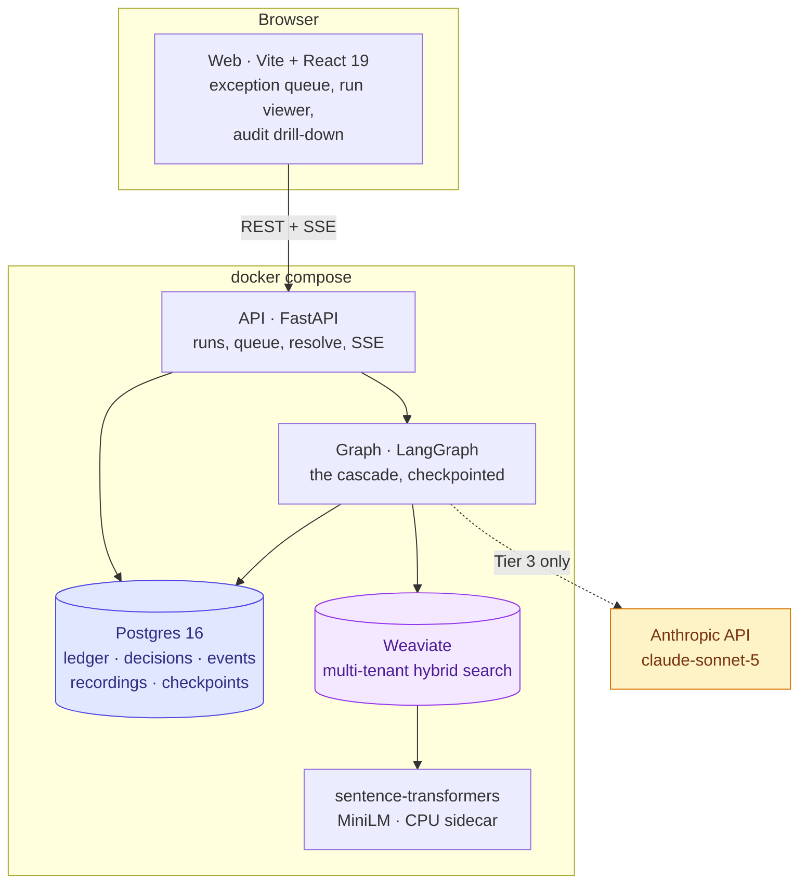
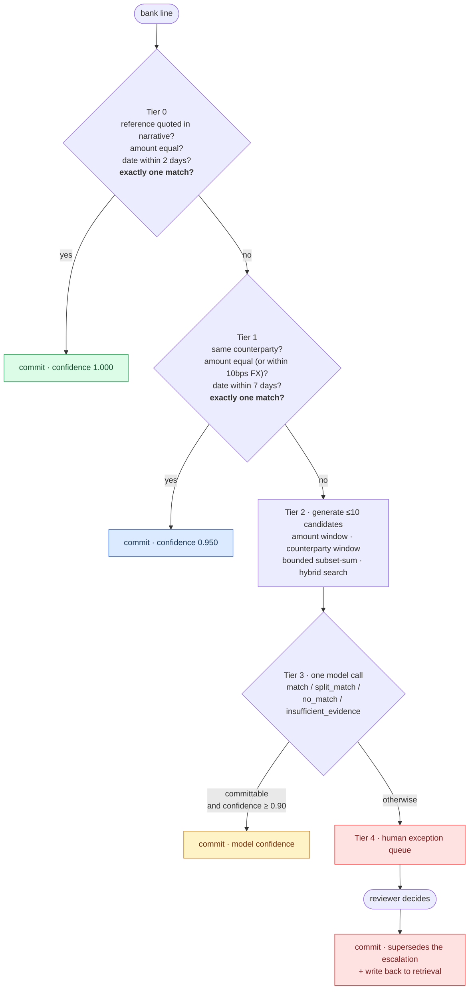
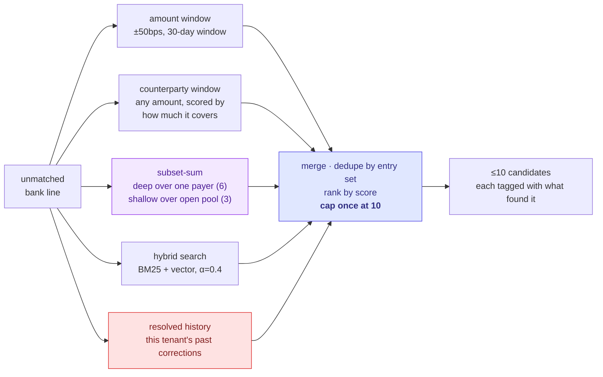
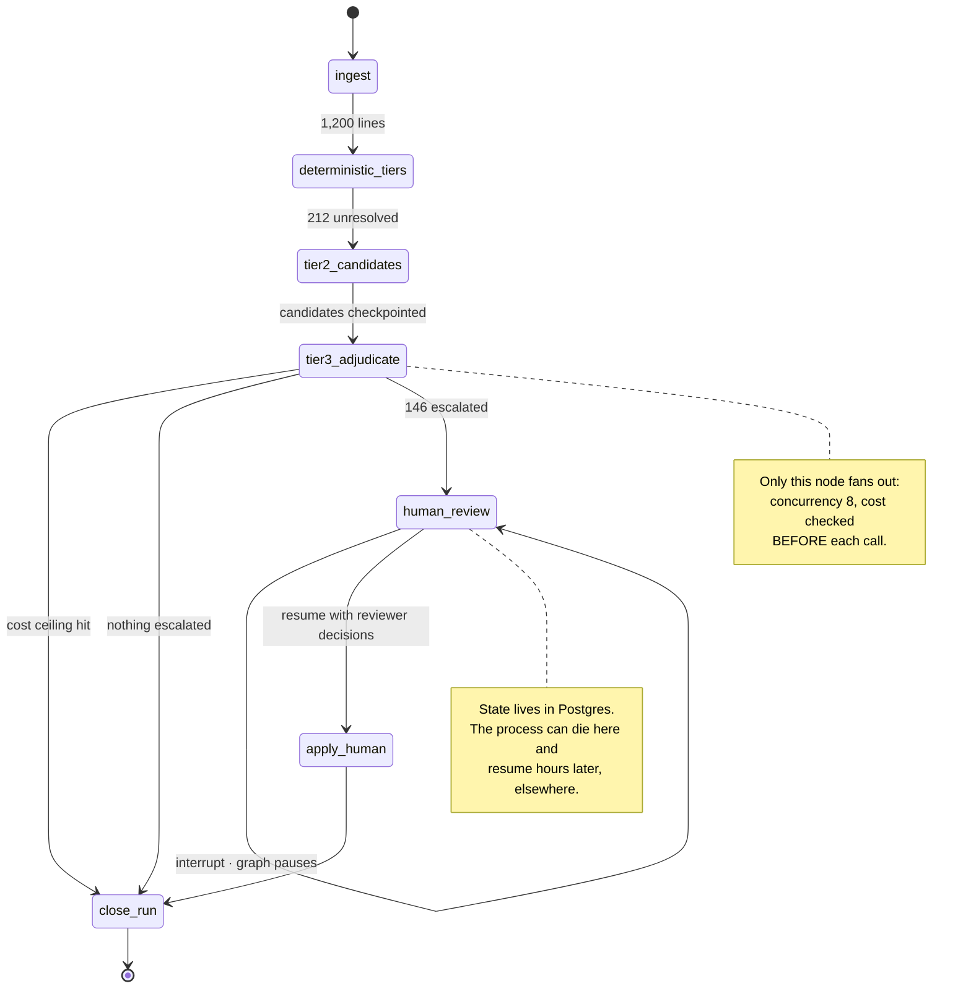
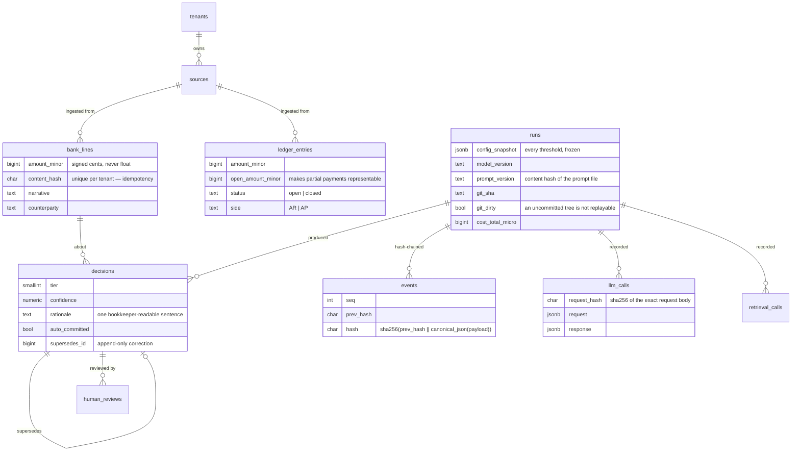
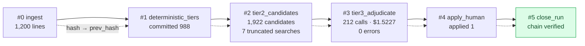
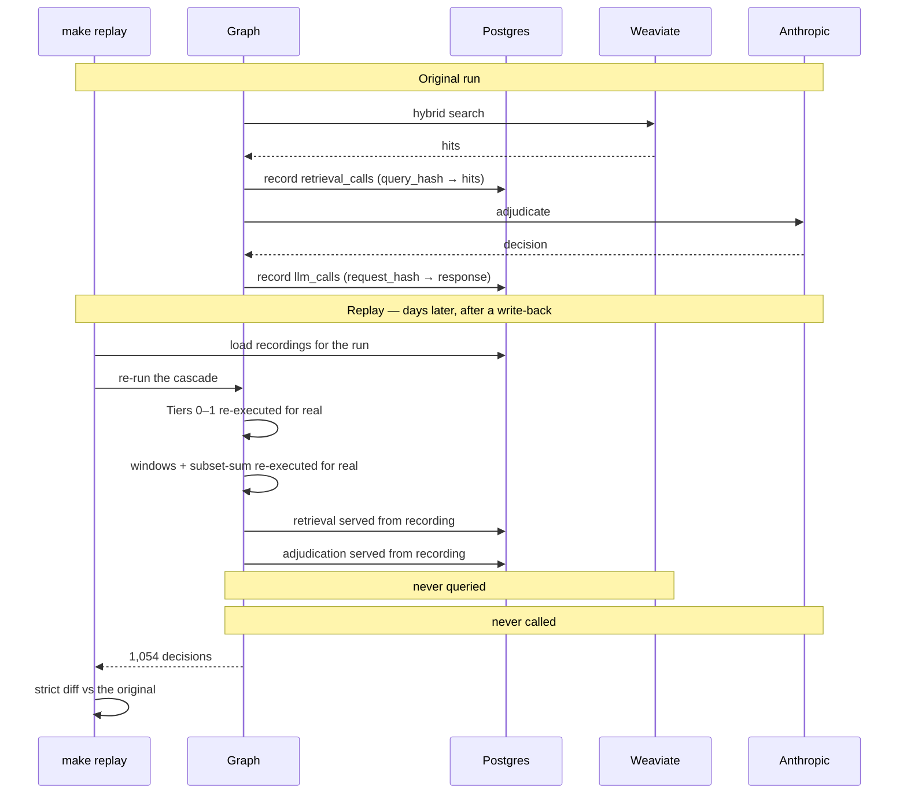
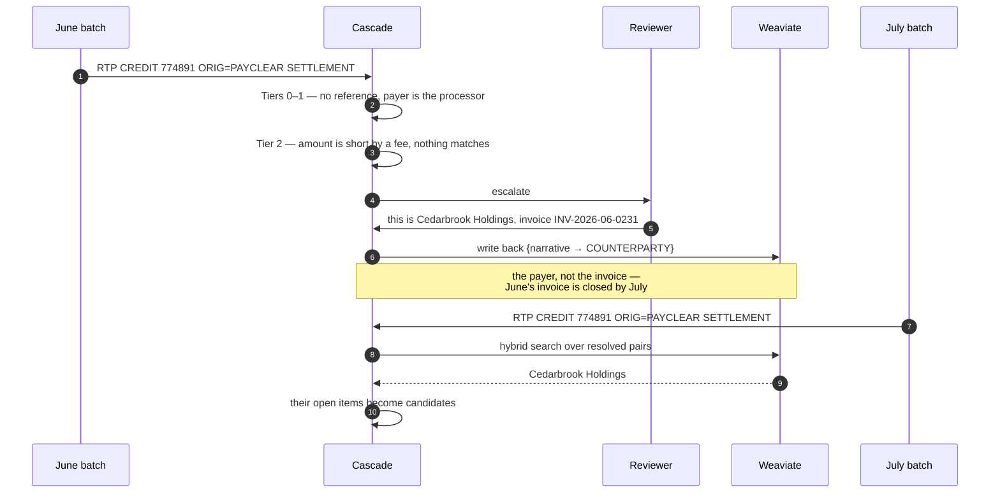
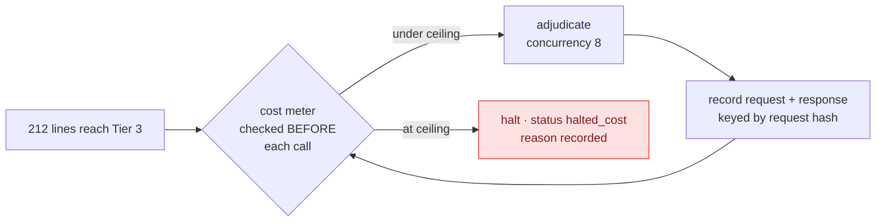

# Architecture

How the system works, why it is shaped this way, and where the load-bearing
guarantees live. Numbers throughout are measured on the seeded month
(`2026-06`, 1,200 bank lines) with a live `claude-sonnet-5` adjudicating.

- [The shape of the problem](#the-shape-of-the-problem)
- [Containers](#containers)
- [The matching cascade](#the-matching-cascade)
- [Tier 2 in detail](#tier-2-in-detail-candidate-generation)
- [The graph](#the-graph)
- [Data model](#data-model)
- [The audit chain](#the-audit-chain)
- [Replay](#replay)
- [The feedback loop](#the-feedback-loop)
- [Cost control](#cost-control)
- [Where the guarantees live](#where-the-guarantees-live)

---

## The shape of the problem

Reconciliation is not one matching problem. It is a stack of them, and they
have wildly different economics.

Most bank lines quote an invoice number and pay it exactly. Arithmetic settles
those, for nothing, in milliseconds. A smaller set needs structure — the payer
and the amount agree, the reference is missing. A much smaller set needs
judgement: a payment short by a wire fee, one credit clearing six invoices, a
narrative that names a payment processor instead of the tenant.

The expensive mistake is not missing a match. It is **committing a wrong one**,
because that becomes a journal entry a bookkeeper has to find and unwind weeks
later. So the system is arranged to make being unsure cheap and being wrong
expensive:

```mermaid
flowchart LR
    A["1,200 bank lines"] --> B["Tier 0 · exact reference<br/>660 lines · 55%<br/>zero AI cost"]
    B -->|"540 left"| C["Tier 1 · payer + amount<br/>328 lines · 27%<br/>zero AI cost"]
    C -->|"212 left"| D["Tier 2 · retrieval<br/>candidates only<br/>commits nothing"]
    D --> E["Tier 3 · model adjudication<br/>212 calls · 66 committed<br/>$1.52"]
    E -->|"146 left"| F["Tier 4 · human queue<br/>reviewed, then written<br/>back into retrieval"]

    style B fill:#dcfce7,stroke:#16a34a,color:#14532d
    style C fill:#dbeafe,stroke:#2563eb,color:#1e3a5f
    style D fill:#f3e8ff,stroke:#9333ea,color:#4c1d95
    style E fill:#fef3c7,stroke:#d97706,color:#78350f
    style F fill:#fee2e2,stroke:#dc2626,color:#7f1d1d
```

**1,054 of 1,200 auto-matched (87.8%) at precision 1.0000, with zero false
positives.** The model is the last thing reached for, not the first.

---

## Containers

Embeddings run in a **self-hosted sidecar**, not a vendor API. An external
embedding service would be faster to wire up, but it breaks "comes up on a
laptop with no network config" and it ties retrieval quality to a model version
replay cannot pin.

The dotted line to Anthropic is the only egress in the matching path, and it is
reached by roughly **one line in six**.

---

## The matching cascade

Each tier sees only what the previous tier could not resolve. A ledger entry
claimed by an earlier tier is invisible to later ones — one open item cannot
settle two bank lines.

**The uniqueness requirement in bold is the safety story.** If a quoted
reference resolves to more than one open item, Tier 0 declines rather than
picking. Two open items at the same amount for the same payer, and Tier 1
declines. Neither tier ever breaks a tie.

Measured per tier on the live run:

| Tier | Committed | Correct | Wrong | Precision |
|---|---|---|---|---|
| 0 — deterministic exact | 660 | 660 | 0 | **1.0000** |
| 1 — deterministic structural | 328 | 328 | 0 | **1.0000** |
| 3 — model adjudication | 66 | 66 | 0 | **1.0000** |

Recall is deliberately absent from that table. A tier only ever sees what
earlier tiers could not resolve, so "recall for Tier 3" has no denominator that
means anything. Precision does: of what this tier committed, how much was right.

---

## Tier 2 in detail: candidate generation

Tier 2 commits nothing. Its only job is recall — **a candidate it fails to
surface is one adjudication can never choose**, so it sets the ceiling on
everything downstream.

Three things here were learned the hard way.

**Singles and subsets are capped together, once.** Capping them separately
returns twenty candidates against a brief asking for ten, and lets a weak single
displace the correct six-invoice combination.

**Subset-sum runs at two scopes.** The brief asks whether a line equals "the sum
of 2–3 open items"; the eval plants a case where one credit clears **six**.
Both are real, and C(60,6) is 50 million combinations while C(60,3) is 34
thousand. The resolution is that a batched settlement is a *remittance* — its
invoices share a payer — so the search runs **deep over a counterparty-scoped
pool** and **shallow over an open one**.

**Ranking happens inside the search, before truncation.** When one agent remits
twice in a month, several combinations sum to the target *exactly*; ranking the
survivors is ranking a list the right answer was already dropped from.

Measured recall@10 over the 212 lines that reach Tier 2:

| Arm | recall@10 |
|---|---|
| Windows + subset-sum only | 0.8177 |
| + hybrid retrieval | 0.8229 |
| ...excluding the cold-start processor class | **0.9875** |

The 32 misses are all `h_feedback`: processor-obscured lines that carry no
reference, name the processor rather than the payer, and arrive short by a
processing fee. They are *supposed* to be unreachable on a cold start — see
[the feedback loop](#the-feedback-loop).

---

## The graph

Tiers are **batched**: each node processes the whole unresolved set in one pass.
One graph invocation per transaction would multiply checkpoint writes by 1,200
and make the cost ceiling unenforceable, because nothing would hold the running
total.

Two node-level decisions worth stating.

**Tiers 0 and 1 share one node.** They share a `claimed` set, and splitting them
would mean checkpointing that set as graph state for no benefit.

**Tier 2's candidates go into the checkpoint, and Tier 3 adjudicates exactly
those.** Recomputing them in the next node looked harmless and was not: a vector
index is eventually consistent, so the same query moments apart returns
different hits, and the model was shown candidates that were never recorded.
Twelve of 212 lines diverged on replay before this was fixed. It also did the
retrieval work twice.

---

## Data model

Details that carry weight:

- **`amount_minor` is a signed `bigint`.** Money is `Decimal` in Python and
  integer minor units in the database. A test AST-scans every module in the
  matching path and fails if a float ever meets a `*_minor` value.
- **`open_amount_minor`** is what makes a partial payment representable at all.
  Without it, `split_match` has nowhere to land.
- **`git_dirty`** is recorded because claiming replayability from an
  uncommitted tree is exactly the thing a technical buyer catches.
- **`decisions` and `events` are append-only, enforced by a raising trigger**,
  not by convention. A correction inserts a new row pointing at the one it
  supersedes; the original stays.

---

## The audit chain

Every graph node writes one event before returning, in the **same transaction**
as the decisions it produced. A decision that exists without its audit event, or
an event describing a decision that was rolled back, is worse than either
failing.

`hash = sha256(prev_hash ‖ canonical_json(payload))`, so editing or removing any
event breaks every link after it. `close_run` verifies the whole chain and
refuses to close a run whose trail is broken. Tampering with one payload is
detected at the right index.

The writer **reloads its tail from the database** rather than trusting an
in-memory `prev_hash`: a run resumes in a different process after an interrupt,
and a stale head produces a chain that verifies in one process and fails
everywhere else.

Events carry a *sample* of bank references, not all of them. One node committed
988, which made the hashed payload enormous and the SSE frame unreadable; the
full set is recoverable from `decisions`.

---

## Replay

The claim is narrow and worth stating exactly: **given the same inputs the
system reaches the same decisions, and the model was not re-rolled to make that
true.**

**The cut is deliberate: deterministic code is re-executed, anything that leaves
the process is replayed from a recording.** Tiers 0–1, the amount and date
windows, and the subset search all run for real, because that is where replay
bugs actually hide — an accidental set iteration, an unsorted candidate list, a
wall-clock date window.

Retrieval had to join the model on the recorded side. Re-executing it broke the
moment the feedback loop did its job: a human correction written back between
the run and the replay changes what retrieval returns, so replay compared two
different worlds and reported drift that was not a regression. On the realistic
demo ordering — correct on Monday, replay on Tuesday — it would fail every time.

A recording miss is a **failure**, never a live call. Falling back would make
the claim false while appearing to succeed. `make replay` exits non-zero and
names the likely causes.

Measured against the live model run: **IDENTICAL, 1,054 of 1,054 decisions**,
with the retrieval index having changed in between.

---

## The feedback loop

Some payments are unreachable by any rule. A corporate tenant pays through a
processor: the narrative names the processor, carries no invoice reference, and
the credit arrives short by a processing fee. No window can bridge that.

**What gets written back is the counterparty, not the invoice.** June's invoice
is closed by July, so remembering "this narrative meant `INV-2026-06-0231`" is
worthless next month; remembering "this narrative shape means Cedarbrook
Holdings" keeps paying off. That distinction is the whole loop.

Only approvals produce a pair. A rejection means "none of these", which is
useful in an audit trail and actively misleading as retrieval history — it would
teach the index a payer nobody confirmed.

Measured on every `make eval`:

| | recall@10 on next month's processor lines |
|---|---|
| Before any correction | **0.0000** (0/16) |
| After 32 corrections written back | **1.0000** (16/16) |

Write-back is **best effort on purpose**. The decision is already committed, so
a retrieval failure costs future recall, never accuracy. It is reported, not
raised.

---

## Cost control

Measured on the live run:

| | |
|---|---|
| Model calls | 212 (one line in six) |
| Tokens | 409,552 in / 58,989 out |
| Prompt cache | **93.2%** of input tokens served from cache |
| Cost | **$1.52** per month · **$1.27 per 1,000 lines** |
| Latency | p50 3,419 ms · p95 4,693 ms |

The per-run ceiling defaults to **$3.00** — set from measurement, not a guess. A
1,200-line month costs $1.52, so the earlier $2.00 default left only 31%
headroom and would trip on a slightly larger batch. The ceiling exists to stop a
runaway, not to fail a normal month.

Cost is integer **nano-USD** throughout, for the same reason money is minor
units: a ceiling that halts a run is a decision, and decisions are not made on
floats. An unpriced model raises rather than defaulting to zero.

### What the model actually answers

| Answer | Count |
|---|---|
| `insufficient_evidence` | **97** |
| `match` | 45 |
| `no_match` | 44 |
| `split_match` | 26 |

**It declined to guess on 97 of 212 — nearly half of everything that reached
it.** That restraint is what the whole cascade is arguing for, and it is
invisible in a precision number, so it is reported separately.

`insufficient_evidence` may name the candidates that could not be separated.
Telling a reviewer *which two* were tied is more useful than telling them
nothing, and it is safe because that decision is not committable.

---

## Where the guarantees live

| Guarantee | Enforced by | Not by |
|---|---|---|
| Money never touches a float | AST scan over every matching module, failing on a float meeting a `*_minor` value | code review |
| Decisions are append-only | a raising Postgres trigger on `decisions` and `events` | convention |
| Re-ingest is a no-op | `unique (tenant_id, sha256)` on files, `unique (tenant_id, content_hash)` on rows | an "if exists" check |
| One open item settles one bank line | a `claimed` set threaded through the cascade, tested directly | ordering luck |
| No wall-clock in decision logic | AST scan banning `today()`/`now()` in the matching path | discipline |
| Replay is exact | recorded model *and* retrieval calls, keyed by request hash; a miss fails the run | hoping the model is deterministic |
| No silent truncation | bounded searches report `exhausted` vs `truncated`, surfaced in the eval and the UI | assuming the bound is never hit |
| Zero false positives | a regression gate that fails the build on one, independently of precision | a precision threshold alone |

The last row matters most. The eval's headline is the **false-positive count**,
not precision, because "99.5% precise" sounds fine right up until somebody asks
how many wrong journal entries that is.
